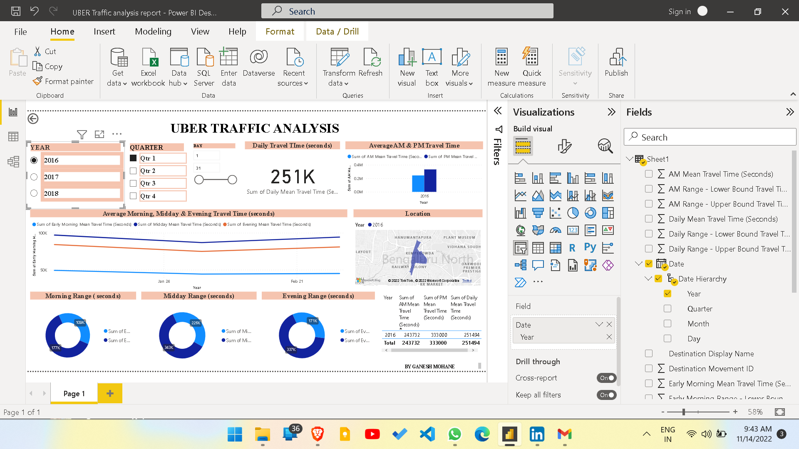
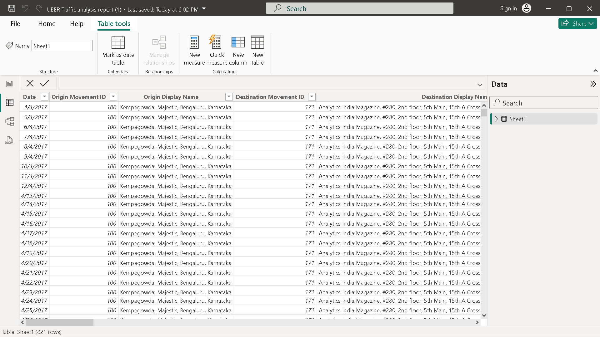
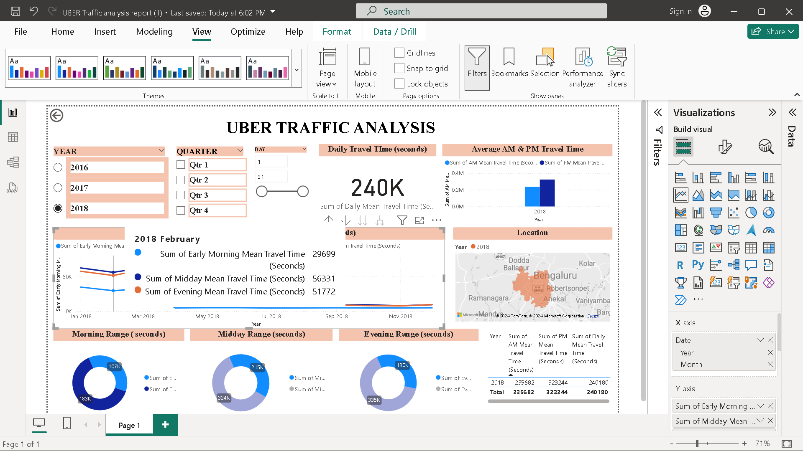

# Uber Traffic Analysis in Bengaluru

## Table of Contents
- [Introduction](#introduction)
- [Project Overview](#project-overview)
- [Data Transformation](#data-transformation)
- [Analysis and Insights](#analysis-and-insights)
- [Power BI Dashboard](#power-bi-dashboard)
- [Conclusion](#conclusion)
- [Acknowledgements](#acknowledgements)
- [Contact](#contact)

## Introduction
This project was completed during my internship with the TCR Innovation. The objective was to analyze Uber traffic data in Bengaluru using Power BI to create an informative and visually appealing dashboard.

## Project Overview
In this project, I utilized raw data from Bengaluru city. The data was transformed to ensure accuracy and relevance, enabling me to generate a comprehensive report on various Uber traffic trends in the city.

## Data Transformation
The data transformation process involved:
- Cleaning the data to remove any inconsistencies or errors
- Normalizing data fields to ensure uniformity
- Aggregating data to obtain meaningful insights

  

## Analysis and Insights
Key insights from the analysis include:
- Peak traffic hours in Bengaluru
- Most popular pick-up and drop-off locations
- Average trip durations and distances
- Traffic trends over different days of the week and times of the day

## Power BI Dashboard
The final output of this project is an interactive Power BI dashboard that presents the data in a user-friendly manner. The dashboard includes:
- Visualizations of traffic patterns and trends
- Filters to view data for specific time periods or locations
- Interactive elements to explore the data in detail

## Conclusion
The analysis of Uber traffic data in Bengaluru provided valuable insights into the city's traffic patterns. This information can be used to improve traffic management and enhance the user experience for Uber riders.

## Acknowledgements
I would like to thank the TCR Innovation for the opportunity to work on this project and for their support throughout the internship.

## Contact
For any questions or further information, please contact me at:
- Email: mailto:ganeshmohane5@gmail.com
- LinkedIn: https://www.linkedin.com/in/ganeshmohane

